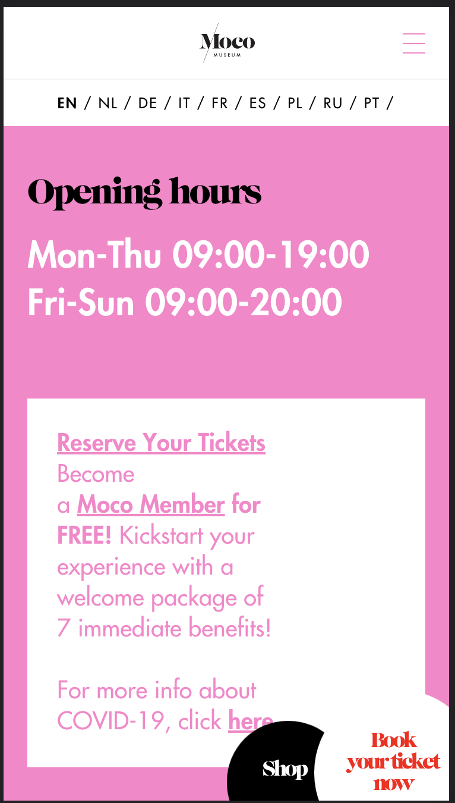
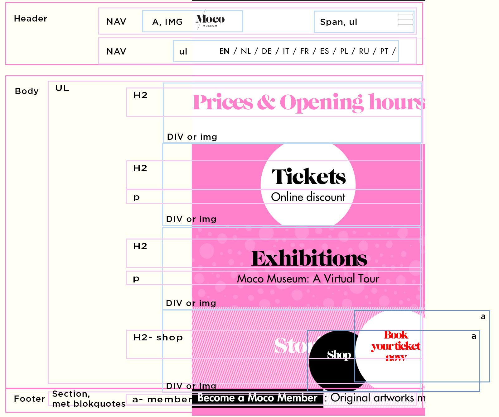

# Procesverslag
Markdown is een simpele manier om HTML te schrijven.  
Markdown cheat cheet: [Hulp bij het schrijven van Markdown](https://github.com/adam-p/markdown-here/wiki/Markdown-Cheatsheet).

Nb. De standaardstructuur en de spartaanse opmaak van de README.md zijn helemaal prima. Het gaat om de inhoud van je procesverslag. Besteedt de tijd voor pracht en praal aan je website.

Nb. Door *open* toe te voegen aan een *details* element kun je deze standaard open zetten. Fijn om dat steeds voor de relevante stuk(ken) te doen.

## Jij

uitwerken voor kick-off werkgroep

### Auteur:
Romythu Zwijnenburg Tran

#### Je startniveau:
Rood

#### Je focus:
Responsive
 

## Je website

uitwerken voor kick-off werkgroep

### Je opdracht:
https://mocomuseum.com/

#### Screenshot(s) van de eerste pagina (small screen): 
Home page  

#### Screenshot(s) van de tweede pagina (small screen):
hier de naam van de pagina  

 

## Breakdownschets (week 1)

uitwerken na afloop 2e werkgroep

### de hele pagina: 

### dynamisch deel (bijv menu): 

## Voortgang 1 (week 2)

uitwerken voor 1e voortgang

### Stand van zaken
hier dit ging goed & dit was lastig (neem ook screenshots op van delen van je website en code)
Om eerlijk te zijn, was het een zware start ik vond het moeilijk om er weer in te komen. ik ben nog niet zo ver, maar ik wil dit weeknd flikke stappen maken. 

### Agenda voor meeting
samen met je groepje opstellen

|Romy            | FLeur              | Sofie       | Hidde            |
| Tekst in de    | was er niet bij    | vragen of    |plaatje heeft een |
| circel laten   |                    | ze nog mag   |margin, maar moet |
|                |                    | wisselen     |weg.              |
| ...            | ...                |              |selecteren moeilijk|

### Verslag van meeting
hier na afloop snel de uitkomsten van de meeting vastleggen

- divs en spans aanpassen
- classes weghalen

## Voortgang 2 (week 3)

uitwerken voor 2e voortgang

### Stand van zaken
hier dit ging goed & dit was lastig (neem ook screenshots op van delen van je website en code)

### Agenda voor meeting
samen met je groepje opstellen

| romy           | Fleur              | Sofie       | Hidde            |
| ---            | Javascript animatie|iconen in form| knop hamburger   |
|                | h2, p,img op elkaar|              |                  |
| -------------- |                    |              |                  |
| ...            | ...                | ...          | ...              |

### Verslag van meeting
hier na afloop snel de uitkomsten van de meeting vastleggen

- verander de pixels naar em
- :root
- ff kijken naar media query
- span voor hamburger

## Toegankelijkheidstest (week 4)

uitwerken na test in 8e voortgang

### Bevindingen
Lijst met je bevindingen die in de test naar voren kwamen:

#### Screen reader
De screenreader kwam heel chaotisch over, en hij las ook niet alles op van wat er op mijn website staat. het was ook heel moeilijk om het aan de praat te krijgen

Beter letten op de symantische volgorde en de alt goed uitschrijven met een goede uitleg

#### visuele beperking
Bij elke bril ervaar je iets anders, met sommige heb je totaal geen problemen

Oplossing kan zijn om een button te creeeren voor kleurenblinde, dat de kleuren dan zijn aangepast en beter te bekijken is voor kleuren blinde. Ook kan je bijv spraak toepassen, zodat er voorgelezen word van wat er allemaal staat. (screenreader)

#### slechte moteriek 
Door dat je vingers eigenlijk vast zitten kan je ook niet makkelijk buigen met je vingers. alles gaat heel moeizaam en stroef. ALs je gebruikt maakt van je toetsen board dan tik je ook telkens meerdere keys tegelijk.

Je kan dit misschien oplossen door spraak toe tepassen, zodat er niet gebruik gemaakt hoef te worden van je toetsenboard. en door niet te kleine buttons te maken.

#### spasme/parkison 
Je klikt telkens onvrijwillig op een knopje of op je muis. waardoor je dingen activeert of iets typt dat je eigenlijk niet wilt.  ook voelt je arm na een tijdje heel moe, zelfs als het appraraat van je arm is.

Dit kan je oplossen dmv grotere knoppen, zodat er meer klik ruimte is of bijv de grote van de menu houden maar de klik ruimte erom heen vergroten. Verder is ook een oplossing om de vormgeving groter te doen.

#### concentratie problemen
De screenreader kwam heel chaotisch over, en hij las ook niet alles op van wat er op mijn website staat. het was ook heel moeilijk om het aan de praat te krijgen

Hier een omschrijving van hoe het opgelost kan worden (met indien nodig een afbeelding)

## Voortgang 3 (week 4)

uitwerken voor 3e voortgang

### Stand van zaken
hier dit ging goed & dit was lastig (neem ook screenshots op van delen van je website en code)

### Agenda voor meeting
samen met je groepje opstellen

| Romy              | Sofie                 | Hidee         | Fleur            |
|Logo in het midden | Display, row, justify | Grid maken    |                  |            
|ul,li in menu in   |                       |               |
|in het midden      | en dit                |               |                  |
|Grid responsive    | dit als er tijd is    |               |                  |
| ...               | ...                   | ...           | ...              |

### Verslag van meeting
hier na afloop snel de uitkomsten van de meeting vastleggen

- punt 1
- punt 2
- nog een punt
- ...

## Eindgesprek (week 5)

uitwerken voor eindgesprek

### Stand van zaken
Het coderen ging in het begin erg moeizaam en ik liep ook een weekje vast. 
Bij het hamburger menu liep ik erg vast, maar de student assistent heeft mij geholpen.

Ook was de shop en book your ticket menu maken erg moeilijk. (ik heb het geprobeerd maar het is niet perfect zoals ik wilde)

Wat wel goed ging, was het maken van de grid, na de oefeningen begreep ik het en kon ik het zo maken. 

Voor de volgende keer moet ik niet alles tegelijk willen maken, maar stap voor stap. ik heb gemerkt dat ik graag alles tegelijk wil doen en dat ik dan door de war raak, door de chaos

### Screenshot(s)
Desktop

Ipad

Mobiel

## Bronnenlijst

continu bijhouden terwijl je werkt

Nb. Wees specifiek ('css-tricks' als bron is bijv. niet specifiek genoeg).

1. https://www.w3schools.com/tags/att_a_href.asp
2. https://codepen.io/mranenko/pen/wevamj?editors=1010
3. https://developer.mozilla.org/en-US/docs/Web/CSS/CSS_Grid_Layout/Realizing_common_layouts_using_CSS_Grid_Layout
4. https://codepen.io/shooft/pen/jOwrXQj 
5. https://css-tricks.com/snippets/css/a-guide-to-flexbox/ 
6. https://www.w3schools.com/html/html_tables.asp
7. https://www.w3schools.com/cssref/pr_text_text-decoration.asp
8. https://www.w3schools.com/howto/howto_css_image_center.asp
9. https://www.seobility.net/en/wiki/Media_Queries

